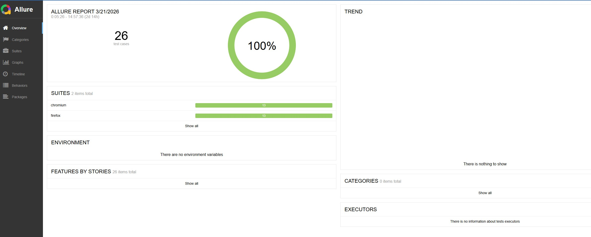

# 🎭 Playwright Automation — SauceDemo

## 📋 Descripción
Framework de automatización de pruebas E2E para SauceDemo,
implementado con Playwright y TypeScript siguiendo el patrón
Page Object Model (POM) y buenas prácticas de la industria.

## 🛠️ Tecnologías
- Playwright 1.44
- TypeScript 5.0
- Allure Reports
- GitHub Actions CI/CD
- Patrón POM
- dotenv para manejo de credenciales

## 📁 Estructura del proyecto
src/
├── pages/        # Page Objects (POM)
├── fixtures/     # Setup reutilizable
├── data/         # Datos de prueba
└── types/        # Interfaces TypeScript

tests/
├── auth/         # Tests de autenticación
├── inventory/    # Tests del catálogo
└── checkout/     # Tests del flujo E2E

## 🚀 Cómo ejecutar

# Instalar dependencias
npm install
npx playwright install

# Correr todos los tests
npm test

# Correr con interfaz visual
npm run test:ui

# Ver reporte
npm run report:playwright

## 📊 Casos de prueba cubiertos
| Módulo | Tests | Cobertura |
|---|---|---|
| Login | 4 | Positivo, bloqueado, vacío, contraseña incorrecta |
| Inventario | 6 | Conteo, ordenamiento, carrito |
| Checkout | 1 | Flujo E2E completo |

Corriendo de forma paralela en firefox y chromium

## ✅ Pipeline CI/CD
Cada push ejecuta automáticamente los tests en GitHub Actions
con reporte de resultados.

## 📸 Reporte de resultados
