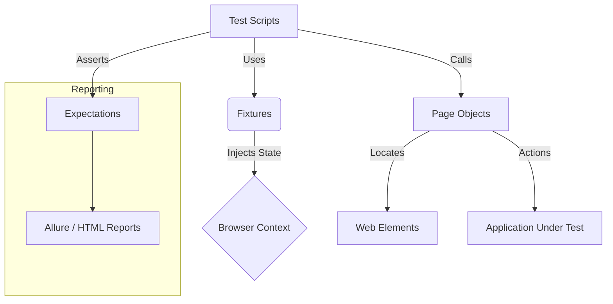

# 🎭 Playwright Automation — SauceDemo

[](https://playwright.dev/)
[](https://www.typescriptlang.org/)

[](https://allurereport.org/)

> **Language / Idioma:** [🇺🇸 English](#-english) | [🇪🇸 Español](#-español)

---

## 🇺🇸 English

### 📖 Overview
This repository contains a robust **End-to-End (E2E) Test Automation Framework** designed for the [SauceDemo](https://www.saucedemo.com/) e-commerce platform. Built with **Playwright** and **TypeScript**, it demonstrates enterprise-level testing patterns, focusing on scalability, maintainability, and execution speed.

### ✨ Key Features

*   **Page Object Model (POM):** Strict separation between test logic and UI interaction methods for better maintainability.
*   **Optimized Authentication:** Uses custom **Fixtures** to inject session cookies (`session-username`), bypassing the UI login screen for non-login tests. This significantly reduces execution time.
*   **Cross-Browser Testing:** Configured to run in parallel on **Chromium** and **Firefox**.
*   **Type Safety:** Fully typed with TypeScript to catch errors at compile time.
*   **Advanced Reporting:** Integrated with **Allure Reports** for detailed visualization of test results.
*   **CI/CD Ready:** Includes GitHub Actions workflow configuration.

### 📐 Architecture



### 🏗 Project Structure

```text
src/
├── data/           # Static test data and environment config
├── fixtures/       # Custom Playwright fixtures (Auth injection)
├── pages/          # Page Objects (POM implementation)
└── types/          # TypeScript interfaces and type definitions

tests/
├── auth/           # Login & Logout scenarios
├── calculations/   # Business logic (Tax & Totals)
├── cart/           # Cart management scenarios
├── checkout/       # E2E purchase flow & Validation
├── details/        # Product Details view
└── inventory/      # Product catalog validation
```

### 🚀 Getting Started

#### Prerequisites
*   Node.js v18+
*   npm or yarn

#### Installation
```bash
npm install
npx playwright install
```

#### Configuration
Create a `.env` file in the root directory (optional if using defaults):
```env
BASE_URL=https://www.saucedemo.com
STANDARD_USER=standard_user
LOCKED_USER=locked_out_user
PASSWORD=secret_sauce
```

### 🧪 Execution

The framework includes several scripts to run tests in different modes:

| Command | Description |
| :--- | :--- |
| `npm test` | Run all tests in headless mode (Parallel) |
| `npm run test:ui` | Open Playwright UI runner |
| `npm run test:auth` | Run only Authentication tests |
| `npm run test:cart` | Run only Cart management tests |
| `npm run test:checkout` | Run Checkout flows |
| `npm run report:allure` | Generate and serve Allure Report |

### 📊 Test Coverage

| Module | Coverage | Technical Details |
| :--- | :--- | :--- |
| **Login** | Functional / Auth | Standard, locked-out, and edge case flows. |
| **Logout** | Security | Secure session termination and history (Back button) blocking. |
| **Inventory** | Functional / UI | List sorting, data persistence. |
| **Details** | Navigation / UI | Element verification in detail view and return flow. |
| **Cart** | Business Logic | Add/Remove items, persistence on reload. |
| **Checkout** | E2E Flow | Complete purchase happy path. |
| **Validation** | Forms / Error Handling | Checkout form constraints & required fields. |
| **Calculations** | Math Logic | Precise tax validation and total summation. |

### 📈 Reporting

Reports are generated via **Allure**, with evidence stored in `/docs`.

---

## 🇪🇸 Español

### 📖 Descripción General
Este repositorio contiene un **Framework de Automatización de Pruebas E2E** robusto diseñado para la plataforma SauceDemo. Construido con **Playwright** y **TypeScript**, demuestra patrones de prueba de nivel empresarial, enfocándose en la escalabilidad, mantenibilidad y velocidad de ejecución.

### ✨ Características Principales

*   **Page Object Model (POM):** Estricta separación entre la lógica de prueba y los métodos de interacción con la UI.
*   **Autenticación Optimizada:** Uso de **Fixtures** personalizados para inyectar cookies de sesión (`session-username`), evitando el paso por el login en tests que no lo requieren y reduciendo drásticamente el tiempo de ejecución.
*   **Ejecución Multi-Navegador:** Configurado para correr en paralelo en **Chromium** y **Firefox**.
*   **Tipado Fuerte:** Completamente tipado con TypeScript para prevenir errores en tiempo de compilación.
*   **Reportes Avanzados:** Integración con **Allure Reports** para métricas detalladas.

### 🏗 Estructura del Proyecto

```text
src/
├── data/           # Datos de prueba y configuración de entorno
├── fixtures/       # Fixtures personalizados (Inyección de Auth)
├── pages/          # Page Objects (Implementación POM)
└── types/          # Interfaces y definiciones de tipos

tests/
├── auth/           # Escenarios de Login y Logout
├── calculations/   # Lógica de negocio (Impuestos/Total)
├── cart/           # Gestión del carrito de compras
├── checkout/       # Flujo E2E y Validaciones
├── details/        # Vista de detalle de productos
└── inventory/      # Validación del catálogo de productos
```

### 🚀 Comenzando

#### Prerrequisitos
*   Node.js v18+
*   npm o yarn

#### Instalación
```bash
npm install
npx playwright install
```

#### Configuración
Crea un archivo `.env` en la raíz (opcional si usas los defaults):
```env
BASE_URL=https://www.saucedemo.com
STANDARD_USER=standard_user
LOCKED_USER=locked_out_user
PASSWORD=secret_sauce
```

### 🧪 Ejecución

El framework incluye scripts específicos para diferentes necesidades:

| Comando | Descripción |
| :--- | :--- |
| `npm test` | Ejecuta todos los tests en modo headless (Paralelo) |
| `npm run test:ui` | Abre la interfaz interactiva de Playwright |
| `npm run test:auth` | Ejecuta solo tests de Autenticación |
| `npm run test:cart` | Ejecuta solo tests del Carrito |
| `npm run test:checkout` | Ejecuta flujos de Checkout |
| `npm run report:allure` | Genera y abre el reporte Allure |

### 📊 Cobertura de Pruebas

| Módulo | Cobertura | Detalles Técnicos |
| :--- | :--- | :--- |
| **Login** | Funcional / Auth | Flujos estándar, usuario bloqueado y casos borde. |
| **Logout** | Seguridad | Cierre de sesión y bloqueo de navegación (Atrás). |
| **Inventory** | Funcional / UI | Ordenamiento de listas, persistencia de datos. |
| **Details** | Navegación / UI | Verificación de elementos en vista de detalle y retorno. |
| **Cart** | Lógica de negocio | Adición/Remoción, persistencia tras recarga. |
| **Checkout** | Flujo E2E | Happy path de compra completa. |
| **Validación** | Formularios / Errores | Restricciones de campos y mensajes de error en Checkout. |
| **Calculations** | Lógica Matemática | Validación precisa de impuestos y sumatoria de totales. |

### 📈 Reportes y Evidencia

Se realiza reporte por medio de **Allure**, dejando la evidencia en `/docs`.


## 📬 Contact / Contacto

Created by **Luis David Valencia** - Portfolio Project.

[!LinkedIn](https://www.linkedin.com/in/luisdavidvalencia/)
